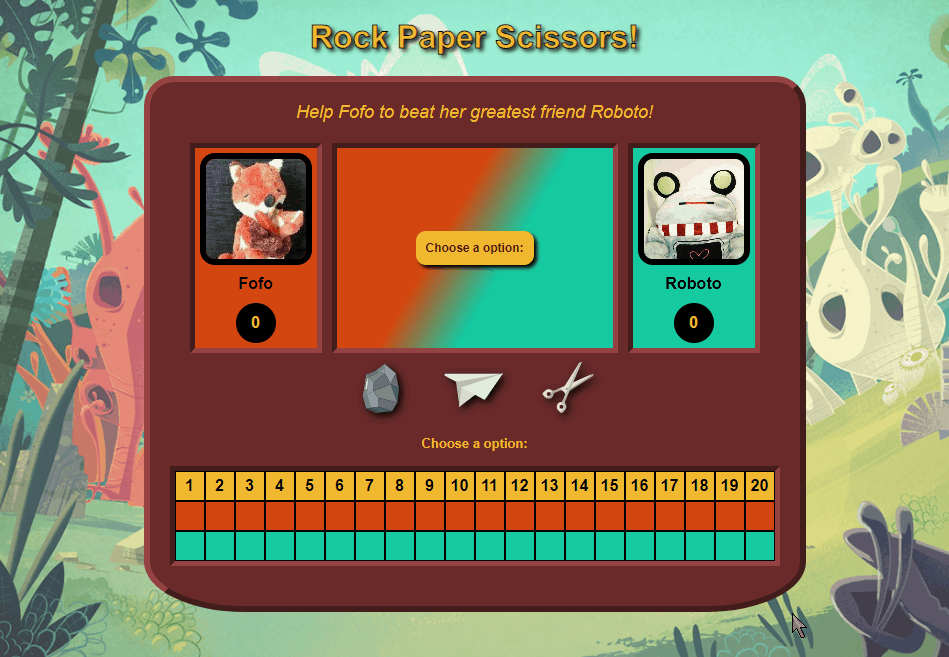
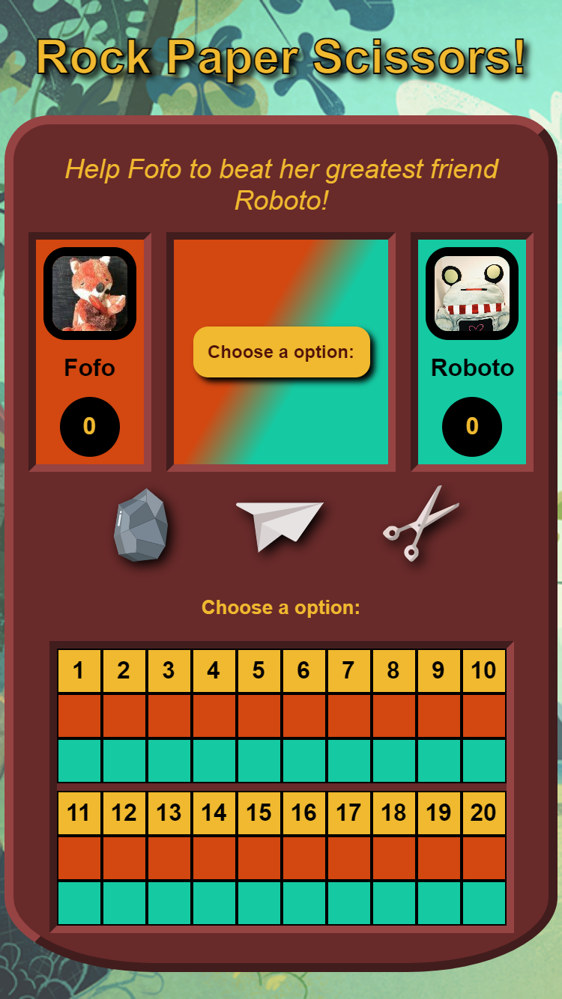

# rock-paper-scissors

<h2 align="center"><a  href="https://aurelien-genois.github.io/rock-paper-scissors/">Live Demo</a></h2>

## Description
The [second Odin project](https://www.theodinproject.com/paths/foundations/courses/foundations/lessons/rock-paper-scissors) is a rock-paper-scissors game for practice bacic JavaScript (variables, data-types, conditionals, functions,...).
CSS is used to add some design and UX (joyfull color theme, one color for each player, green for the winner, yellow for neutral informations, dynamic animations on svg pictures) .

## Features

- The user plays on the browser
- A message is displayed for each round result
- Each round is recorded in a table
- Dynamic green color informs the user of the winner
- A popup shows the game result after 5 wins or 20 rounds if no 5 wins

## Challenges
The organisation of the code in several functions and the DOM manipulation (especially changing textcontents and classes) were the principals goals this project. 

I also practiced css animation to render a more joyfull interface and visual feedacks. 

Adapting the layout to mobile was eventually interesting, in particular for divide the rounds table in two tables (one on top of the other) for small width.

